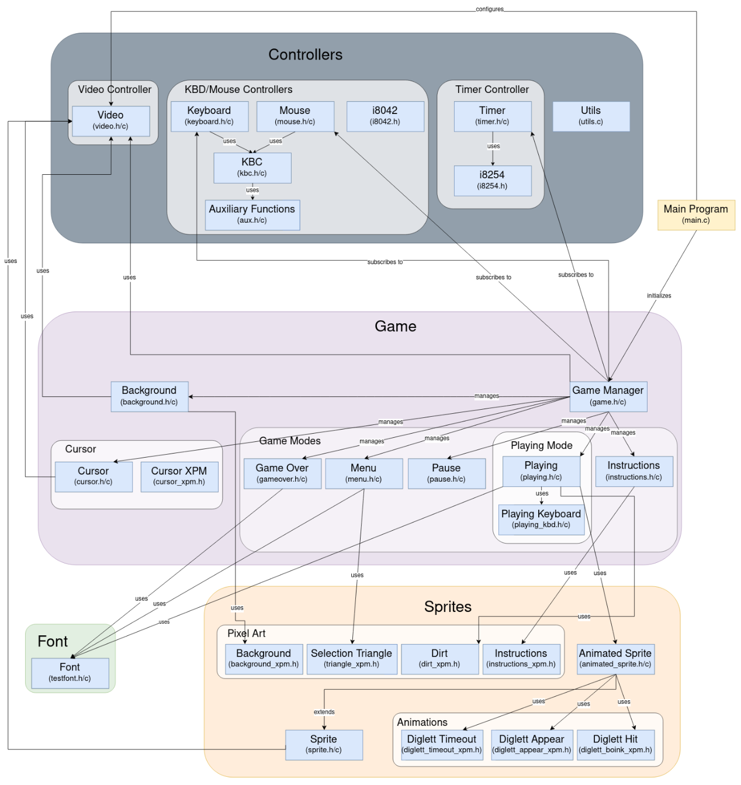

# Whack'a Diglett

A Minix-based implementation of a whack-a-mole style game featuring Diglett Pokémon characters. 
This project was developed as part of the LCOM (Laboratory of Computers) course at FEUP.

## Video Demo
<a href='https://uporto.cloud.panopto.eu/Panopto/Pages/Viewer.aspx?id=88df2542-6c0e-475b-951b-b2ef012c267f'>video demo</a>

## Project Overview

Whack'a Diglett is a 2D game built from scratch for the Minix operating system, featuring real-time graphics, user input handling, and smooth animations. The game challenges players to whack appearing Diglett characters within a time limit to achieve the highest score possible.

### Game Features

- **Multiple Game Modes**: Menu, gameplay, pause, instructions, and game over screens
- **Dual Input Support**: Play using either keyboard or mouse controls
- **Real-time Progress Tracking**: Dynamic time bar and score counter
- **Smooth Animations**: Triple buffering for flicker-free animation transitions
- **Randomized Gameplay**: Unpredictable Diglett appearances for engaging replay value

## System Architecture

### Core Architecture Diagram


### Key Components

#### Hardware Interaction Layer

- **Timer Controller**: Manages game timing, animation frames, and game duration (60Hz)
- **Keyboard Controller**: Processes player input for menu navigation and gameplay
- **Mouse Controller**: Provides alternative input method with real-time cursor tracking
- **Video Controller**: Handles drawing operations and buffer management

#### Game Logic Layer

- **Game Core**: Controls main loop and state machine
- **Mode Managers**: Handle specific behaviors for different game states
- **Diglett System**: Manages individual timing and state transitions for each Diglett

#### Visual Components

- **Sprites**: Both static and animated visual elements
- **Buffer Management**: Multi-buffer system for smooth rendering
- **UI Elements**: Score display, time bar, menus, and cursor

### Differentiating Features

#### Advanced Diglett System

- Independent timer scheduling for each Diglett
- Randomized show/hide durations to prevent predictable patterns
- Five-state lifecycle (hidden→visible→boinking→timing_out→hidden)

#### Real-time Progress Indicators

- Dynamic time bar with color transitions based on remaining time
- Immediate score updates upon successful or missed whacks
- Accurate time tracking using system clock for reliable game duration

## Building and Running the Project

### Prerequisites

- Minix 3.1.8
- LCOM development environment

### Compilation

```
$ cd labs/proj/src/
$ make clean && make
```

### Running

```
$ lcom_run proj
```

## Project Structure

```
proj/
├── src/
│   ├── main.c                 # Program entry point
│   ├── controllers/           # Hardware abstraction layer
│   │   ├── kbdmouse/         # Keyboard and mouse controllers
│   │   ├── timer/            # Timer controller
│   │   └── video/            # Video controller
│   ├── game/
│   │   ├── game.c/h          # Main game loop and state machine
│   │   ├── background.c/h    # Background management
│   │   ├── cursor/           # Cursor implementation
│   │   ├── modes/            # Game modes (menu, playing, etc.)
│   │   └── sprites/          # Sprite management
│   └── fonts/                # Text rendering
└── doc/                      # Documentation
```

## Gameplay Instructions

1. Start the game from the main menu
2. When Digletts appear, whack them by:
   - Pressing the corresponding key in keyboard mode
   - Clicking directly on the Diglett in mouse mode
3. Score points for successful whacks before they disappear
4. The game ends after 60 seconds
5. Try to achieve the highest score possible!

## Development Team

- <a href='https://github.com/franpts2'>Francisca Portugal</a>
- <a href='https://github.com/gab1demattos'>Gabriela de Mattos</a>
- <a href='https://github.com/maluviieira'>Maria Luiza Vieira</a>
- <a href='https://github.com/staragarcia'>Sara García</a>


## Acknowledgments

- LCOM teaching staff at FEUP
- Minix operating system developers
- Pokémon franchise for the Diglett character inspiration
